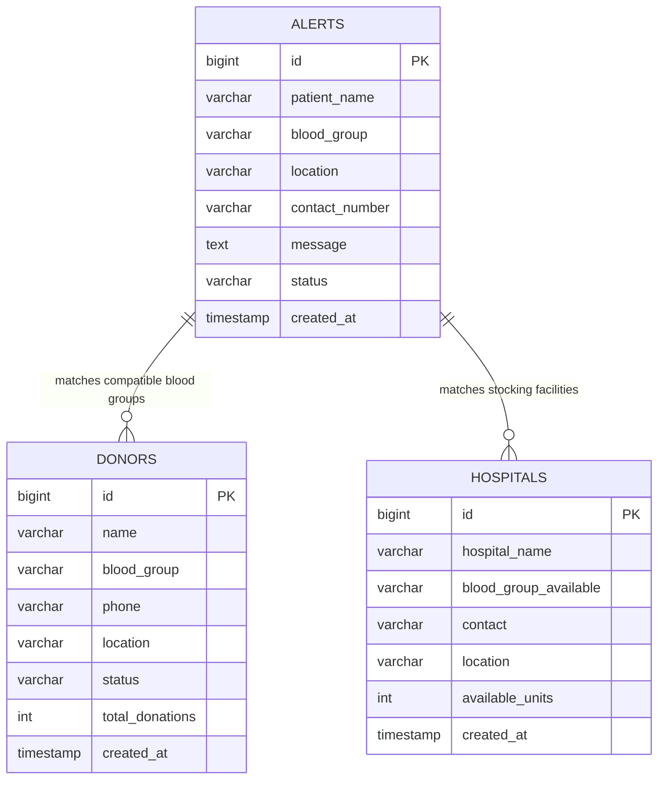

# 🩸 LifePulse - Emergency Blood Alert System

[](https://openjdk.org/)
[](https://spring.io/projects/spring-boot)
[](https://getbootstrap.com/)
[](https://www.mysql.com/)

A mission-critical emergency blood coordination web application designed to connect patients in dire medical emergencies with nearby hospital blood banks and verified voluntary blood donors.

---

## 📑 Table of Contents
1. [System Architecture Diagram](#1-system-architecture-diagram)
2. [Entity-Relationship (ER) Diagram](#2-entity-relationship-er-diagram)
3. [Complete Project Structure](#3-complete-project-structure)
4. [Tech Stack](#4-tech-stack)
5. [Prerequisites & Environment](#5-prerequisites--environment)
6. [MySQL Database Setup Instructions](#6-mysql-database-setup-instructions)
7. [Running the Backend (Spring Boot)](#7-running-the-backend-spring-boot)
8. [Running the Frontend](#8-running-the-frontend)
9. [Postman API Testing Guide](#9-postman-api-testing-guide)
10. [Production Deployment Guide](#10-production-deployment-guide)

---

## 1. System Architecture Diagram

```mermaid
graph TD
    Client[Web Browser / Mobile Client] -->|HTML5, CSS3, Bootstrap 5| UI[Frontend Portal]
    UI -->|1. Client Validation| Validator[validation.js]
    UI -->|2. Geolocation API| GPS[GPS Coordinates]
    UI -->|3. POST /api/alerts| API[Spring Boot REST Controllers]
    
    subgraph Spring Boot Backend :8080
        API -->|@Valid RequestDto| Controller[AlertController]
        Controller -->|Invokes| Service[AlertService]
        Service -->|Persists Data| AlertRepo[AlertRepository]
        Service -->|Transfusion Matrix| Engine[Clinical Matching Engine]
        Engine -->|Queries Donors| DonorRepo[DonorRepository]
        Engine -->|Queries Hospitals| HospitalRepo[HospitalRepository]
        Service -->|Triggers Alert| Notif[NotificationService]
        Notif -.->|Simulated SMS| Twilio[Twilio SMS Gateway]
        Notif -.->|Simulated Email| Mail[Spring Mail SMTP]
    end

    subgraph MySQL Database :3306
        AlertRepo --> DB[(blood_alert_db)]
        DonorRepo --> DB
        HospitalRepo --> DB
    end

    Controller -->|4. Standard JSON ApiResponse| UI
    UI -->|5. Render Live Matches| Client
```

---

## 2. Entity-Relationship (ER) Diagram



---

## 3. Complete Project Structure

```text
Blood Scanner/
├── frontend/
│   ├── index.html                  # Responsive Emergency Portal UI (Bootstrap 5)
│   ├── css/
│   │   └── style.css               # Medical Emergency Theme & Keyframe Animations
│   └── js/
│       ├── data.js                 # Sample datasets & transfusion compatibility rules
│       ├── validation.js           # Client-side input validation suite
│       └── app.js                  # Frontend controller & REST fetch() integration
│
├── backend/
│   ├── pom.xml                     # Maven configuration (Java 21, Spring Boot 3.3.4)
│   └── src/
│       └── main/
│           ├── java/com/bloodbond/alertsystem/
│           │   ├── BloodAlertSystemApplication.java   # Spring Boot entry point & seeder
│           │   ├── controller/
│           │   │   ├── AlertController.java           # POST /api/alerts, GET /api/alerts
│           │   │   ├── DonorController.java           # GET /api/donors/search
│           │   │   └── HospitalController.java        # GET /api/hospitals/search
│           │   ├── service/
│           │   │   ├── AlertService.java              # Alert persistence & matching logic
│           │   │   ├── DonorService.java              # Donor search & query operations
│           │   │   └── NotificationService.java       # SMS (Twilio) & Email dispatch
│           │   ├── repository/
│           │   │   ├── AlertRepository.java           # Spring Data JPA alert queries
│           │   │   ├── DonorRepository.java           # Donor queries & compatibility filter
│           │   │   └── HospitalRepository.java        # Hospital queries & inventory filter
│           │   ├── entity/
│           │   │   ├── Alert.java                     # JPA Entity mapped to 'alerts'
│           │   │   ├── Donor.java                     # JPA Entity mapped to 'donors'
│           │   │   └── Hospital.java                  # JPA Entity mapped to 'hospitals'
│           │   ├── dto/
│           │   │   ├── AlertRequestDto.java           # Validated incoming alert payload
│           │   │   └── ApiResponse.java               # Standardized JSON response envelope
│           │   └── exception/
│           │       └── GlobalExceptionHandler.java    # Centralized REST error handler
│           └── resources/
│               └── application.properties             # Spring datasource & server port
│
├── database/
│   └── setup.sql                   # MySQL schema, table DDLs, and seed records
└── README.md                       # Comprehensive documentation & setup manual
```

---

## 4. Tech Stack

- **Frontend**: HTML5, CSS3, JavaScript (ES6+), Bootstrap 5.3, Font Awesome 6.
- **Backend**: Java 21 LTS, Spring Boot 3.3.4, Spring Data JPA, Hibernate ORM, Apache Tomcat (embedded).
- **Database**: MySQL 8.0+ (with H2 test profile).
- **Architecture**: Three-tier architecture (Controller -> Service -> Repository -> Database).

---

## 5. Prerequisites & Environment

Ensure you have the following installed on your system:
1. **Java Development Kit (JDK 21+)** (e.g. Eclipse Temurin or IntelliJ bundled JBR at `C:\Program Files\JetBrains\IntelliJ IDEA 2025.3.3\jbr`).
2. **Apache Maven 3.8+** (bundled with IntelliJ or installed globally).
3. **MySQL Server 8.0+** running locally on port `3306`.
4. Any modern web browser (Google Chrome, Microsoft Edge, Firefox, Brave).

---

## 6. MySQL Database Setup Instructions

### Option A: Using MySQL Workbench (GUI)
1. Open **MySQL Workbench**.
2. Connect to your local MySQL instance (`localhost:3306`).
3. In the top menu, go to **File -> Open SQL Script...**.
4. Navigate to `database/setup.sql` in this project folder.
5. Click the **Lightning Bolt ⚡** icon on the toolbar to execute the script.
6. Check the Schemas tab on the left to confirm `blood_alert_db` has been created with tables `alerts`, `donors`, and `hospitals`.

### Option B: Using MySQL Command Line
Open a PowerShell or Terminal window:
```powershell
mysql -u root -p < "c:\Users\manda\OneDrive\Desktop\Blood Scanner\database\setup.sql"
```
*(Enter your MySQL root password when prompted)*.

---

## 7. Running the Backend (Spring Boot)

1. Open PowerShell and navigate to the `backend` directory:
   ```powershell
   cd "c:\Users\manda\OneDrive\Desktop\Blood Scanner\backend"
   ```

2. Configure your `JAVA_HOME` (if not already set in environment variables):
   ```powershell
   $env:JAVA_HOME = "C:\Program Files\JetBrains\IntelliJ IDEA 2025.3.3\jbr"
   ```

3. Run the Spring Boot application using Maven:
   ```powershell
   & "C:\Program Files\JetBrains\IntelliJ IDEA 2025.3.3\plugins\maven\lib\maven3\bin\mvn.cmd" spring-boot:run
   ```
   *(Or simply run `mvn spring-boot:run` if Maven is in your system PATH).*

4. The backend will boot in ~2 to 3 seconds:
   ```text
   ===============================================================
    LifePulse Emergency Blood Alert System REST Backend is ACTIVE! 
    Port: http://localhost:8080                                    
   ===============================================================
   ```

> **Automatic Seeder Note**: Even if you haven't run `setup.sql`, the Spring Boot application features an automatic `@Bean CommandLineRunner` in `BloodAlertSystemApplication.java` that checks if the database is empty and automatically seeds initial test hospitals and donors!

---

## 8. Running the Frontend

The frontend is lightweight and zero-dependency:
1. Navigate to the `frontend` folder:
   `c:\Users\manda\OneDrive\Desktop\Blood Scanner\frontend`
2. **Double-click `index.html`** to open it in your browser, or open:
   `file:///c:/Users/manda/OneDrive/Desktop/Blood Scanner/frontend/index.html`
3. The page will immediately connect to your Spring Boot REST server on `http://localhost:8080/api`. If the server is offline, it automatically falls back to client-side mode so testing is never blocked.

---

## 9. Postman API Testing Guide

### 1. Trigger Emergency Alert
- **Method**: `POST`
- **URL**: `http://localhost:8080/api/alerts`
- **Headers**: `Content-Type: application/json`
- **Body** (`raw / JSON`):
  ```json
  {
    "patientName": "Sunita Rao",
    "bloodGroup": "O-",
    "location": "City General Hospital, ICU Ward 4",
    "contactNumber": "9876543210",
    "message": "Critical condition - Emergency surgical transfusion requires 2 units of O- blood immediately."
  }
  ```
- **Expected Status**: `201 Created`
- **Sample Response**:
  ```json
  {
    "success": true,
    "message": "Emergency alert broadcasted successfully. Nearby resources notified.",
    "data": {
      "alert": {
        "id": 2,
        "patientName": "Sunita Rao",
        "bloodGroup": "O-",
        "location": "City General Hospital, ICU Ward 4",
        "contactNumber": "9876543210",
        "message": "Critical condition - Emergency surgical transfusion requires 2 units of O- blood immediately.",
        "status": "ACTIVE",
        "createdAt": "2026-09-12T21:50:00"
      },
      "compatibleGroups": ["O-"],
      "matchingHospitals": [ ... ],
      "matchingDonors": [ ... ]
    },
    "timestamp": "2026-09-12T21:50:00"
  }
  ```

---

### 2. Fetch Active Alerts
- **Method**: `GET`
- **URL**: `http://localhost:8080/api/alerts/active`
- **Expected Status**: `200 OK`

---

### 3. Fetch Dashboard Live Counts
- **Method**: `GET`
- **URL**: `http://localhost:8080/api/alerts/stats`
- **Expected Status**: `200 OK`
- **Sample Response**:
  ```json
  {
    "success": true,
    "message": "Dashboard statistics fetched.",
    "data": {
      "activeAlerts": 2,
      "totalHospitals": 5,
      "totalDonors": 10
    }
  }
  ```

---

### 4. Search Donors by Blood Group & Location
- **Method**: `GET`
- **URL**: `http://localhost:8080/api/donors/search?bloodGroup=O-&location=Central`
- **Expected Status**: `200 OK`

---

### 5. Search Hospitals by Location
- **Method**: `GET`
- **URL**: `http://localhost:8080/api/hospitals/search?location=Civil`
- **Expected Status**: `200 OK`

---

## 10. Production Deployment Guide

### Packaging the Application JAR
In the `backend` folder, run:
```powershell
mvn clean package -DskipTests
```
This produces a standalone executable JAR in:
`backend/target/blood-alert-system-1.0.0.jar`

### Running the Production JAR
```powershell
java -jar target/blood-alert-system-1.0.0.jar
```

### Docker Containerization (Optional)
Create a `Dockerfile` in `backend/`:
```dockerfile
FROM eclipse-temurin:21-jre-alpine
WORKDIR /app
COPY target/blood-alert-system-1.0.0.jar app.jar
EXPOSE 8080
ENTRYPOINT ["java", "-jar", "app.jar"]
```
Build and run with Docker:
```bash
docker build -t blood-alert-system:latest .
docker run -p 8080:8080 --name blood-app blood-alert-system:latest
```

---

## 🛡️ License & Medical Disclaimer
This software is intended for emergency coordination and clinical logistics. All patient health identifiers (PHI) should be transmitted over encrypted HTTPS/TLS in production environments.
