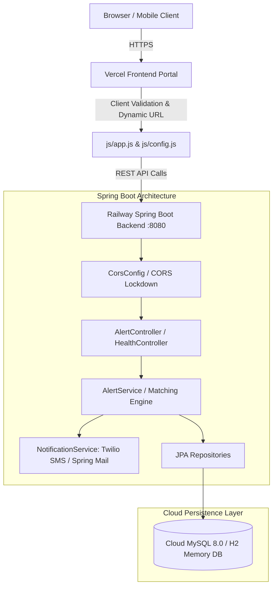

# 🩸 LifePulse - Emergency Blood Alert System

[](https://openjdk.org/)
[](https://spring.io/projects/spring-boot)
[](https://temporary-instant-peridot-o5qcil0.vercel.app)
[](https://blood-scanner-production.up.railway.app)
[](https://www.mysql.com/)

A mission-critical emergency blood coordination application designed to connect patients in dire medical emergencies with nearby hospital blood banks and verified voluntary blood donors in real time.

---

## 🌐 Live Production Deployments

| Component | Platform | Live URL |
| :--- | :--- | :--- |
| **Frontend Portal** | **Vercel** | [https://temporary-instant-peridot-o5qcil0.vercel.app](https://temporary-instant-peridot-o5qcil0.vercel.app) |
| **Backend REST API** | **Railway** | [https://blood-scanner-production.up.railway.app](https://blood-scanner-production.up.railway.app) |
| **Cloud Health Probe** | **Railway** | [https://blood-scanner-production.up.railway.app/api/health](https://blood-scanner-production.up.railway.app/api/health) |
| **Database** | **Railway** | Cloud MySQL 8.0 (Encrypted SSL Connection) |

---

## 📑 Table of Contents
1. [System Architecture](#1-system-architecture)
2. [Tech Stack](#2-tech-stack)
3. [Project Directory Layout](#3-project-directory-layout)
4. [Local Development Quickstart](#4-local-development-quickstart)
5. [Docker Compose Full-Stack Setup](#5-docker-compose-full-stack-setup)
6. [Cloud Deployment (Railway & Vercel)](#6-cloud-deployment-railway--vercel)
7. [REST API Documentation & Testing](#7-rest-api-documentation--testing)
8. [Automated Testing Suite](#8-automated-testing-suite)
9. [Production Hardening & Security Notes](#9-production-hardening--security-notes)

---

## 1. System Architecture



---

## 2. Tech Stack

- **Frontend**: HTML5, CSS3 (Medical Theme, CSS Custom Properties), JavaScript (ES6+ Modules), Bootstrap 5.3, Font Awesome 6.
- **Backend**: Java 21 LTS, Spring Boot 3.3.4, Spring Data JPA, Hibernate 6 ORM, Embedded Apache Tomcat.
- **Database**: MySQL 8.0+ (Production) / In-Memory H2 with MySQL compatibility mode (Testing & Local Dev).
- **Security & Networking**: Centralized dynamic CORS (`CorsConfig`), Bean Validation (`@Valid`, `Jakarta Validation`), Global Exception Interceptor.
- **Testing**: JUnit 5, Spring Boot Test, MockMvc, AssertJ, Hamcrest.
- **Containerization & Cloud**: Multi-stage Dockerfile, Docker Compose, Railway (Backend & DB), Vercel (Frontend).

---

## 3. Project Directory Layout

```text
Blood Scanner/
├── .env.example                            # Template for environment variables
├── docker-compose.yml                      # Full-stack Docker runner (MySQL, Backend, Frontend)
├── database/
│   └── setup.sql                           # MySQL DDL schema and initial seed records
├── frontend/
│   ├── index.html                          # Responsive Emergency Portal UI
│   ├── _redirects                          # SPA routing rules for Netlify
│   ├── vercel.json                         # Routing and security headers for Vercel
│   ├── css/
│   │   └── style.css                       # Medical theme & keyframe animations
│   └── js/
│       ├── config.js                       # Dynamic runtime API endpoint configuration
│       ├── data.js                         # Blood compatibility matrix and defaults
│       ├── validation.js                   # Client-side input validation
│       └── app.js                          # Core UI controller & fetch() integration
└── backend/
    ├── pom.xml                             # Maven configuration (Java 21, Spring Boot 3.3.4)
    ├── mvnw / mvnw.cmd                     # Maven Wrapper (zero-install builds)
    ├── Dockerfile                          # Multi-stage container build
    ├── src/
    │   ├── main/
    │   │   ├── java/com/bloodbond/alertsystem/
    │   │   │   ├── BloodAlertSystemApplication.java   # Spring Boot entry point & DB seeder
    │   │   │   ├── config/
    │   │   │   │   └── CorsConfig.java                # Centralized CORS security policy
    │   │   │   ├── controller/
    │   │   │   │   ├── AlertController.java           # Emergency alert endpoints
    │   │   │   │   ├── DonorController.java           # Donor queries
    │   │   │   │   ├── HospitalController.java        # Hospital queries
    │   │   │   │   └── HealthController.java          # Cloud readiness probe
    │   │   │   ├── service/                           # Business logic & notifications
    │   │   │   ├── repository/                        # Spring Data JPA interfaces
    │   │   │   ├── entity/                            # JPA Entities (Alert, Donor, Hospital)
    │   │   │   ├── dto/                               # ApiResponse envelope & AlertRequestDto
    │   │   │   └── exception/                         # GlobalExceptionHandler (400, 404, 405, 500)
    │   │   └── resources/
    │   │       ├── application.properties             # Dynamic production/local properties
    │   │       └── application-h2.properties          # Zero-setup in-memory database profile
    │   └── test/
    │       └── java/com/bloodbond/alertsystem/
    │           └── controller/                        # 18 automated integration tests
```

---

## 4. Local Development Quickstart

### Prerequisites
- **Java 21 JDK** installed.
- **Node.js** (optional, for running local static frontend server).

### Option A: Zero-Setup Mode (In-Memory H2 Database)
Run the backend with in-memory database — no local MySQL installation required:

```powershell
cd backend
.\mvnw.cmd spring-boot:run -Dspring-boot.run.profiles=h2
```
- Access API at `http://localhost:8080/api`
- Access H2 Web Console at `http://localhost:8080/h2-console` (`JDBC URL: jdbc:h2:mem:blood_alert_db`, User: `sa`, Password: *(blank)*)

### Option B: Local MySQL Mode
1. Ensure MySQL is running on port 3306.
2. Initialize tables and seed data:
   ```bash
   mysql -u root -p < database/setup.sql
   ```
3. Run the backend:
   ```powershell
   cd backend
   .\mvnw.cmd spring-boot:run
   ```

### Running the Frontend
Simply double-click `frontend/index.html` or serve using any static server:
```bash
npx serve frontend -l 3000
```

---

## 5. Docker Compose Full-Stack Setup

Run the complete stack (MySQL 8.0, Spring Boot Backend, Nginx Frontend) with a single command:
```bash
docker compose up -d --build
```
- Frontend: `http://localhost:3000`
- Backend API: `http://localhost:8080/api`
- Health Probe: `http://localhost:8080/api/health`

---

## 6. Cloud Deployment (Railway & Vercel)

### Backend Deployment on Railway
1. Create a new project on [Railway](https://railway.app) and provision a **MySQL** database.
2. Click **New Service** -> **GitHub Repo** -> choose `MandaRathnaRekha/blood-scanner`.
3. In Service Settings:
   - **Root Directory**: `/backend`
4. In **Variables**, supply the following environment variables (no credentials hardcoded in code):
   | Variable | Value |
   | :--- | :--- |
   | `SPRING_DATASOURCE_URL` | `jdbc:mysql://${{MySQL.MYSQLHOST}}:${{MySQL.MYSQLPORT}}/${{MySQL.MYSQLDATABASE}}?useSSL=true&allowPublicKeyRetrieval=true&serverTimezone=UTC` |
   | `SPRING_DATASOURCE_USERNAME` | `${{MySQL.MYSQLUSER}}` |
   | `SPRING_DATASOURCE_PASSWORD` | `${{MySQL.MYSQLPASSWORD}}` |
   | `SPRING_JPA_HIBERNATE_DDL_AUTO` | `update` |
   | `PORT` | `8080` |
   | `CORS_ALLOWED_ORIGINS` | `https://temporary-instant-peridot-o5qcil0.vercel.app` *(or your custom domain)* |
5. Generate a public domain under Networking.

### Frontend Deployment on Vercel
1. Import repository into [Vercel](https://vercel.com/new).
2. Set **Root Directory** to `frontend`.
3. Framework Preset: `Other`.
4. Deploy.

---

## 7. REST API Documentation & Testing

All endpoints return standardized JSON envelopes:
```json
{
  "success": true,
  "message": "...",
  "data": { ... },
  "timestamp": "2026-09-13T..."
}
```

### Key Endpoints

| Method | Endpoint | Description |
| :--- | :--- | :--- |
| `GET` | `/api/health` | Readiness & database connectivity probe |
| `GET` | `/api/alerts` | Fetches all active emergency broadcasts |
| `GET` | `/api/alerts/active` | Alias for active emergency broadcasts |
| `GET` | `/api/alerts/stats` | Aggregated dashboard metrics |
| `GET` | `/api/alerts/match?bloodGroup=O-` | Live blood group compatibility preview |
| `POST` | `/api/alerts` | Broadcast emergency alert & notify resources |
| `GET` | `/api/donors` | List all voluntary donors |
| `GET` | `/api/donors/search?bloodGroup=...` | Query donors by blood group/location |
| `GET` | `/api/hospitals` | List all hospital blood banks |
| `GET` | `/api/hospitals/search?location=...` | Query hospitals by city/area |

---

## 8. Automated Testing Suite

The backend includes 18 automated integration and unit tests covering controllers, compatibility matching, validation, and CORS:

```bash
cd backend
.\mvnw.cmd test
```

### Test Coverage Highlights:
- **`AlertControllerIntegrationTest`**: Verifies active alert retrieval, dashboard counters, live match preview, successful alert creation, and 400 Bad Request responses on invalid client input.
- **`DonorAndHospitalIntegrationTest`**: Verifies donor search, hospital inventory query, and CORS preflight `OPTIONS` responses.
- **`HealthControllerIntegrationTest`**: Verifies cloud health probe and live database connectivity status.
- **`AlertServiceTest`**: Validates blood transfusion compatibility matrix (`O-` universal donor, `AB+` universal recipient).

---

## 9. Production Hardening & Security Notes

- **CORS Lockdown**: Driven by the `CORS_ALLOWED_ORIGINS` environment variable. Never leaves API open to unapproved origins in production.
- **Zero Secrets in Git**: No credentials, API tokens, or passwords are committed to source control.
- **Error Handling**: `GlobalExceptionHandler` ensures stack traces are never exposed; returns clean 400, 404, 405, and 500 JSON envelopes.
- **Container Security**: Dockerfile executes under a non-root system user (`bloodbond`).
